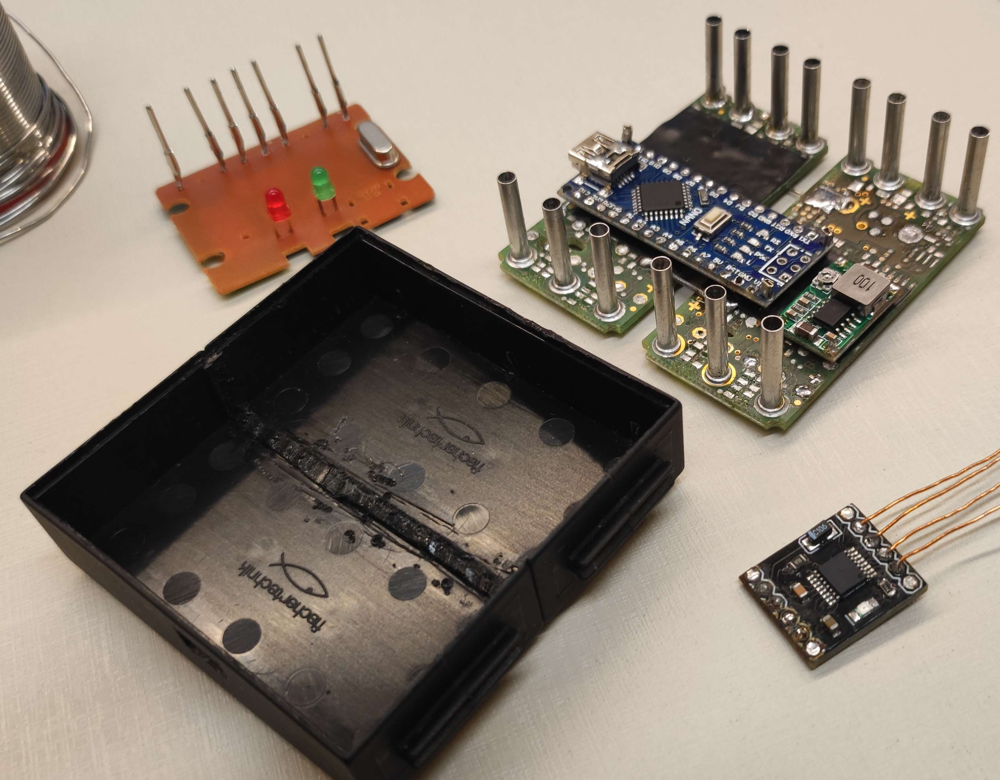
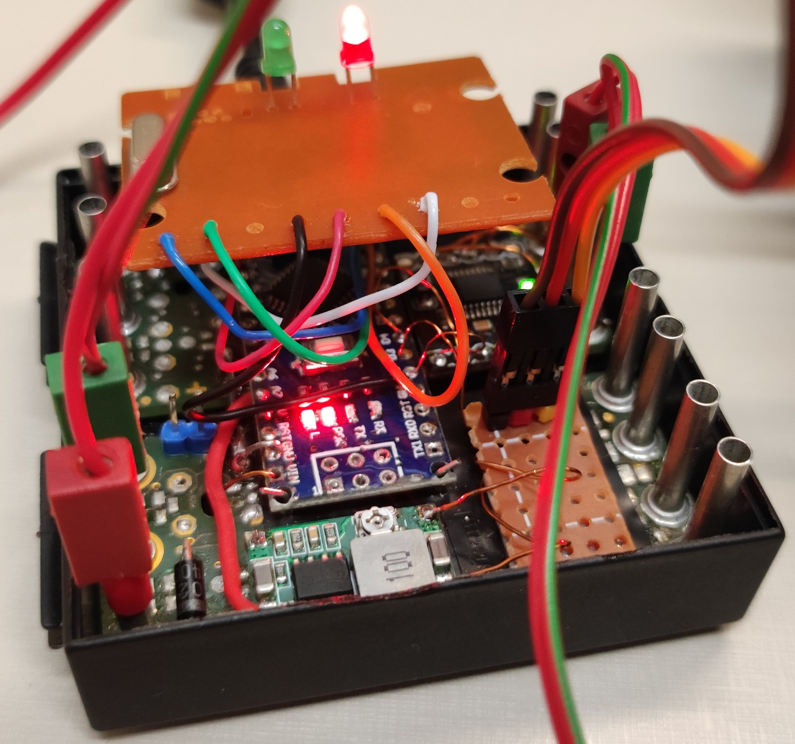
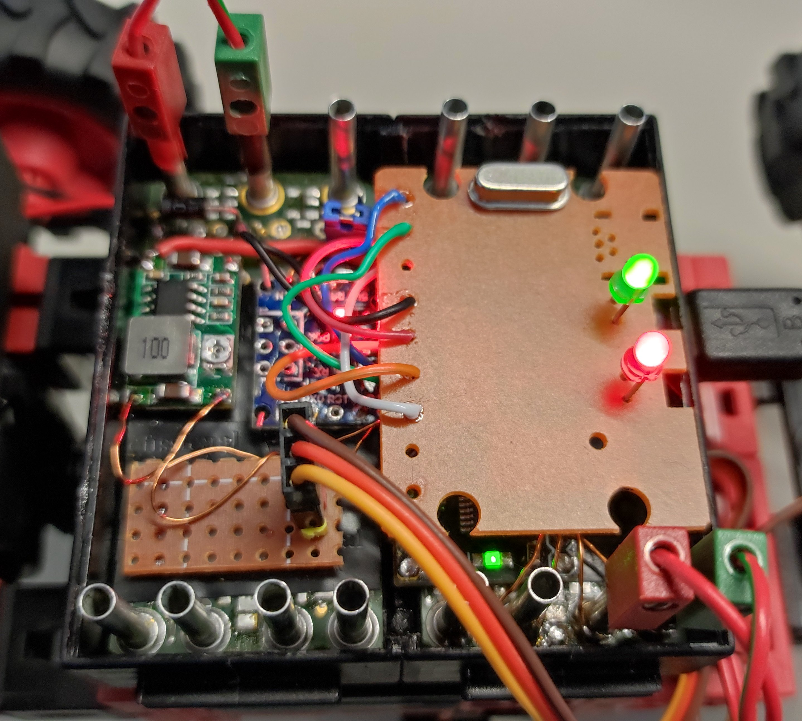

# ft-remote-controller

An Arduino-based remote controller for fischertechnik models with an integrated 2.4GHz receiver. It is designed to be able to remotely control karts, cars, trucks, robots and other models. It will also support an I²C interface so it can be coupled to additional hardware and/or other controllers.

For now it supports two motors and a servo. The first tests were quite successful.

The excellent article from Arnoud Whizzbizz about his [RC with 2.4GHz PS2 controller](https://www.whizzbizz.com/en/ps2.controller) was a very good source of inspiration for this project. Thanks!

## Features

The project is based on the Arduino Nano and fits a 60 × 60 enclosure. I tried to maximize usage of the ports, here are all planned connections:

There are not enough hardware PWM ports in the Nano so I'm using Brett Hagman's SoftPWM library which works perfectly. What it has already:

- 2.4 GHz PS/2 receiver
- 4 DRV8833 9V PWM outputs
- Servo
- 5-6V step-down servo supply
- 4 DIP switches

What is still planned:

- 8 DRV8833 9V PWM outputs
- 2 servos
- 2 I²C ports
- 2 protected inputs
- 4 DIP switches for program selection
- A nicer assembly with lid

## Assembly

The photo shows the main components. The case and the two interconnected green PCBs were obtained from two fischertechnik Sound+Lights modules [130589](https://ft-datenbank.de/ft-article/3930). These boards make things easy for me because they already have the ft sockets in place. I removed all components from them, then cut several copper traces to avoid short circuits. The Nano and the small step-down regulator can be seen already in place. The picture also shows one of the DRV8833 motor drivers. The brown PCB with 2 LEDs is taken from the [PS2 2.4GHz receiver](https://www.google.com/search?q=ps2+2.4+ghz+wireless+controller).

Below is the project for the full controller. The header connectors, DIP switches and reset button will be mounted on a small PCB that will sit on top of one of the lower boards.

## Gallery

Here are some pictures of the controller.

The controller being tested:

A simple kart mounted on a stand for testing:

Another view of the controller, this time already mounted in the kart:

